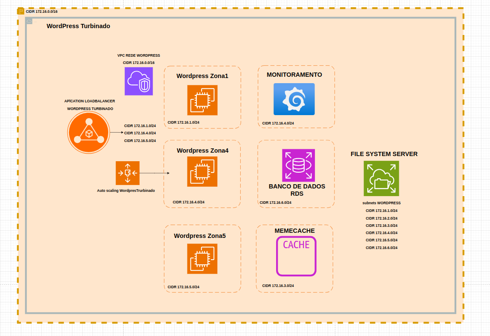

# Wordpress Turbinado 2.0

Infrastructure as Code, instalação automatizada do WordPress e Monitoramento na AWS.

<p align="center">
  
</p>

---

## Objetivo

Provisionar dois servidores WordPress na AWS de forma automatizada com Terraform e Ansible, com banco de dados gerenciado via RDS em rede privada e monitoramento via Prometheus e Grafana.

---

## Arquitetura de Rede

```
                          INTERNET
                              │
                    ┌─────────▼──────────┐
                    │   Internet Gateway  │
                    └─────────┬──────────┘
                              │
          ┌───────────────────▼────────────────────┐
          │         VPC PÚBLICA 172.16.0.0/16       │
          │                                          │
          │  ┌──────────────┐  ┌──────────────┐     │
          │  │ EC2           │  │ EC2           │     │
          │  │ wordpress_a   │  │ wordpress_b   │     │
          │  │ 172.16.1.x    │  │ 172.16.2.x    │     │
          │  │ (IP público)  │  │ (IP público)  │     │
          │  └──────┬───────┘  └──────┬────────┘     │
          └─────────┼─────────────────┼───────────────┘
                    │   VPC Peering   │
                    └────────┬────────┘
                             │
          ┌──────────────────▼─────────────────────┐
          │         VPC PRIVADA 10.0.0.0/16         │
          │                                          │
          │  ┌────────────────────────────────────┐  │
          │  │  Subnets Privadas (sem rota IGW)   │  │
          │  │  10.0.1.0/24                       │  │
          │  │  10.0.2.0/24  ──  RDS MySQL 8.0   │  │
          │  │  10.0.3.0/24                       │  │
          │  └────────────────────────────────────┘  │
          │                                           │
          │  ┌─────────────────────────────────────┐  │
          │  │  Subnet NAT (10.0.0.0/24)           │  │
          │  │  NAT Gateway ──► IGW ──► Internet   │  │
          │  └─────────────────────────────────────┘  │
          └────────────────────────────────────────────┘
```

### Princípios de segurança da rede

| Camada | Acesso de entrada | Acesso de saída |
|--------|------------------|-----------------|
| EC2 (pública) | Internet: 80, 443, 22, 9100 | Internet irrestrito |
| RDS (privada) | Apenas EC2 via VPC Peering (3306) | Via NAT Gateway |

- O RDS **não tem IP público** e não é acessível pela internet
- As EC2 acessam o RDS diretamente pelo VPC Peering, sem passar pela internet
- A senha do RDS é armazenada no **AWS SSM Parameter Store** (nunca no código)
- Variáveis sensíveis do Ansible ficam em `.env` local, protegido pelo `.gitignore`

---

## Pré-requisitos

- Conta válida na AWS com credenciais configuradas (`aws configure`)
- Terraform instalado (>= 1.0)
- Ansible instalado (>= 2.12)
- Par de chaves SSH criado na AWS (`my-ed25519-key`) e chave privada em `~/.ssh/id_ed25519`

---

## Estrutura do Projeto

```
.
├── infraiscode-public/       # Stack Terraform — VPC pública + EC2
│   ├── ec2-instance.tf       # EC2 WordPress (IP público + security group)
│   ├── vpc-publica.tf        # VPC 172.16.0.0/16 + subnets públicas a/b/c
│   ├── security-group.tf     # SGs: EC2 (22,80,443,9100) e RDS e Monitor
│   ├── internet-gw.tf        # Internet Gateway + route table pública
│   ├── route.tf              # Associações subnets públicas à route table
│   └── private.tf            # Chave SSH gerada via Terraform
│
├── infraiscode-private/      # Stack Terraform — VPC privada + RDS
│   ├── vpc.tf                # VPC 10.0.0.0/16 + 3 subnets privadas + subnet NAT
│   ├── network.tf            # IGW, NAT Gateway, route tables privada e NAT
│   ├── peering.tf            # VPC Peering (pública ↔ privada) + rota de retorno
│   ├── rds.tf                # RDS MySQL 8.0 nas subnets privadas
│   └── variables.tf          # ID da VPC pública
│
├── ansible/                  # Automação de instalação
│   ├── .env.example          # Template de variáveis (commitado)
│   ├── .env                  # Variáveis reais — NÃO versionado (.gitignore)
│   ├── inventory.ini         # Hosts — NÃO versionado (.gitignore)
│   ├── wordpress.yml         # Playbook WordPress
│   ├── monitoramento.yml     # Playbook monitoramento
│   └── roles/
│       ├── wordpress/
│       │   ├── tasks/
│       │   │   ├── main.yml
│       │   │   ├── install_wordpress.yml
│       │   │   └── templates/
│       │   │       ├── vhost.nginx.conf.j2
│       │   │       └── wp-config.php.j2
│       │   └── templates/
│       │       ├── vhost.nginx.conf.j2
│       │       └── wp-config.php.j2
│       └── monitoramento/
│           └── tasks/
│               ├── install_prometheus.yaml
│               ├── install_grafana.yaml
│               ├── install_node_exported.yml
│               └── install_alertmanager.yaml
│
└── vaut-server/              # HashiCorp Vault (Docker)
    ├── docker-compose.yml
    ├── .env.example          # Template do token Vault (commitado)
    └── .env                  # Token real — NÃO versionado (.gitignore)
```

---

## Passo 1 — Provisionar Rede Pública + EC2

```bash
cd infraiscode-public/
terraform init
terraform plan
terraform apply
```

### O que é criado

| Recurso | Descrição |
|---------|-----------|
| VPC pública | `172.16.0.0/16` |
| Subnet pública a | `172.16.1.0/24` — us-east-1a |
| Subnet pública b | `172.16.2.0/24` — us-east-1b |
| Subnet pública c | `172.16.3.0/24` — us-east-1c |
| Internet Gateway | Saída para internet das EC2 |
| Security Group EC2 | Portas 22 (SSH), 80 (HTTP), 443 (HTTPS), 9100 (Node Exporter) |
| EC2 `wordpress_a` | Amazon Linux 2023, t3.large, IP público, subnet-a |
| EC2 `wordpress_b` | Amazon Linux 2023, t3.large, IP público, subnet-b |

### IPs públicos das instâncias

| Instância | IP Público |
|-----------|------------|
| wordpress_a | _(gerado pela AWS após apply)_ |
| wordpress_b | _(gerado pela AWS após apply)_ |

---

## Passo 2 — Provisionar Rede Privada + RDS

### Aplicar

```bash
cd infraiscode-private/
terraform init
terraform plan
terraform apply
```

### O que é criado

| Recurso | Descrição |
|---------|-----------|
| VPC privada | `10.0.0.0/16` |
| Subnet NAT | `10.0.0.0/24` — subnet pública exclusiva para o NAT Gateway |
| Subnet privada 1 | `10.0.1.0/24` — us-east-1a |
| Subnet privada 2 | `10.0.2.0/24` — us-east-1b |
| Subnet privada 3 | `10.0.3.0/24` — us-east-1c |
| Internet Gateway | Necessário para o NAT Gateway ter saída para a internet |
| Elastic IP | IP público fixo associado ao NAT Gateway |
| NAT Gateway | Recebe tráfego das subnets privadas e encaminha via IGW |
| Route table NAT | Subnet NAT → `0.0.0.0/0` via Internet Gateway |
| Route table privada | Subnets privadas → `0.0.0.0/0` via NAT Gateway |
| VPC Peering | Comunicação direta entre VPC pública e VPC privada |
| Security Group RDS | Aceita MySQL (3306) apenas do CIDR `172.16.0.0/16` |
| RDS MySQL 8.0 | `db.t3.micro`, 20GB gp2, nas 3 subnets privadas |

### Fluxo de saída da rede privada

```
Subnets privadas (10.0.1-3.x)
        │
        ▼  route: 0.0.0.0/0 → NAT Gateway
NAT Gateway (10.0.0.x)
        │
        ▼  route: 0.0.0.0/0 → Internet Gateway
Internet Gateway (igw-vpc-privada)
        │
        ▼
    INTERNET
```

### Fluxo EC2 → RDS (via VPC Peering)

```
EC2 (172.16.x.x)  ──  VPC Peering  ──  RDS (10.0.x.x porta 3306)
```

### Consultar endpoint do RDS

```bash
terraform output rds_endpoint
```

---

## Passo 3 — Configurar Inventory do Ansible

Crie o arquivo `ansible/inventory.ini` (não versionado):

```ini
[wordpressturbinado]
wordpress_a ansible_host=<IP_PUBLICO_A>
wordpress_b ansible_host=<IP_PUBLICO_B>

[wordpressturbinado:vars]
ansible_user=ec2-user
ansible_ssh_private_key_file=~/.ssh/id_ed25519
ansible_ssh_common_args='-o StrictHostKeyChecking=no'
```

### Configurar variáveis com .env

Copie o template e preencha com os valores reais:

```bash
cd ansible/
cp .env.example .env
```

```yaml
# ansible/.env  (não versionado)
db_host:     "<OUTPUT: terraform output rds_endpoint>"
db_name:     "wordpress"
db_user:     "wpuser"
db_password: "<SUA_SENHA_DO_RDS>"
```

### Testar conectividade

```bash
ansible -i inventory.ini wordpressturbinado -m ping
```

---

## Passo 4 — Instalar WordPress com Ansible

```bash
cd ansible/
ansible-playbook -i inventory.ini wordpress.yml
```

### O que é instalado em cada instância

| Componente | Descrição |
|------------|-----------|
| Nginx | Servidor web |
| PHP 8.1 | Runtime PHP (Amazon Linux 2023) |
| PHP-FPM | Gerenciador de processos PHP |
| WordPress | Última versão, baixada direto do wordpress.org |

> O banco de dados **não é instalado nas EC2**. O WordPress conecta diretamente ao RDS na rede privada usando o `db_host` definido no `.env`.

---

## Passo 5 — Acessar via SSH

```bash
# wordpress_a
ssh -i ~/.ssh/id_ed25519 ec2-user@<IP_PUBLICO_A>

# wordpress_b
ssh -i ~/.ssh/id_ed25519 ec2-user@<IP_PUBLICO_B>
```

---

## Passo 6 — Acessar o WordPress

Após a instalação, acesse no navegador:

```
http://<IP_PUBLICO_A>
http://<IP_PUBLICO_B>
```

Complete o assistente do WordPress para definir título do site, usuário admin e senha.

---

## Passo 7 — Monitoramento (Prometheus + Grafana)

```bash
cd ansible/
ansible-playbook -i monitoramento.ini monitoramento.yml
```

### Métricas coletadas via Node Exporter (porta 9100)

| Métrica | Descrição |
|---------|-----------|
| CPU | Uso de processador |
| Memória | Uso de RAM |
| Disco | Uso de armazenamento |
| Request HTTP | Tráfego de rede |

---

---

## Recursos Opcionais (*)

- Memcached — repositório de sessões
- EFS — armazenamento escalável compartilhado entre instâncias
- Load Balancer + Auto Scaling
- CDN/WAF (Cloudflare ou AWS WAF)
